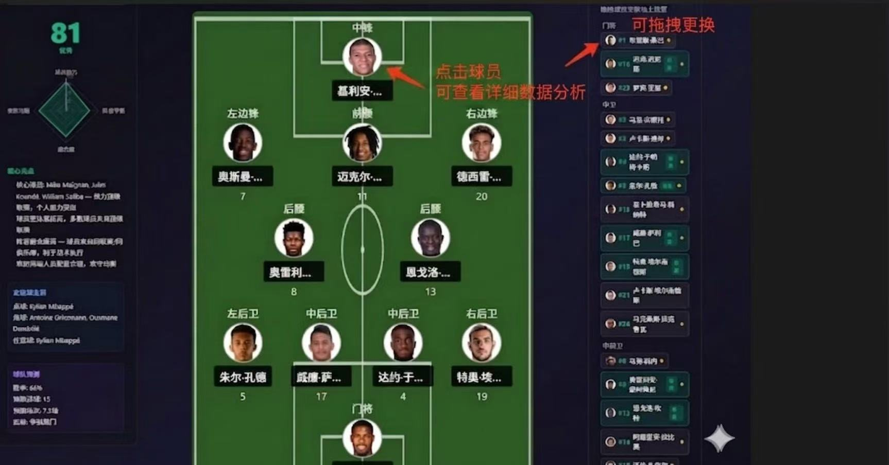
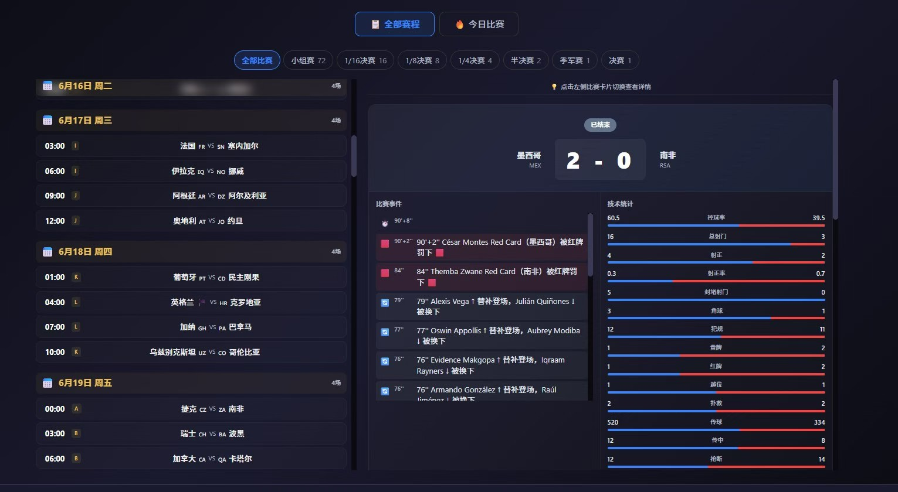
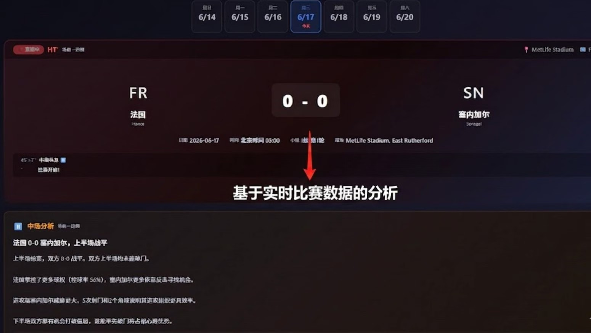
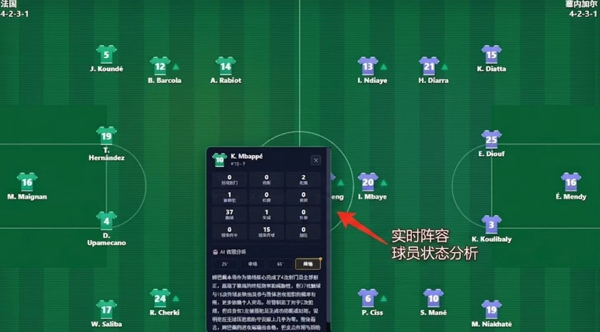
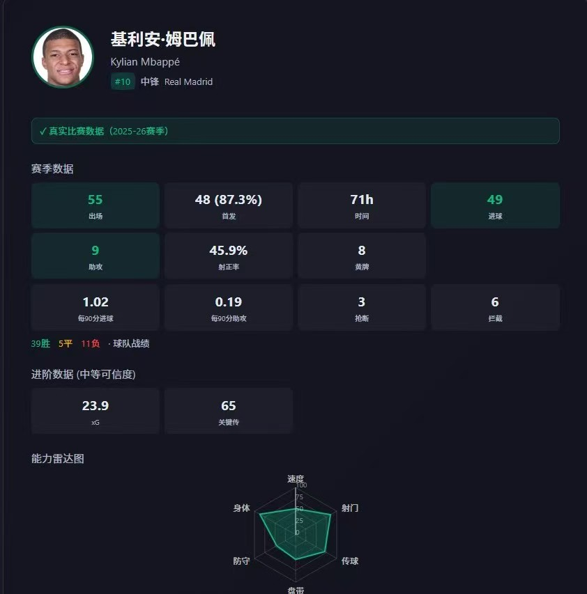

# 探球 - 2026 世界杯数据与战术分析平台

探球是一个面向 2026 世界杯的足球数据产品，把赛程、实时比分、阵容图、球员数据和战术分析放在同一套页面里。它更适合在赛前看阵容、比赛中跟进实时变化，赛后复盘球队和球员表现。

项目地址：[https://github.com/yahya0826/football-ai](https://github.com/yahya0826/football-ai)

## 主要功能

- **首页最近比赛**：根据每日赛程自动刷新推荐比赛，快速进入正在关注的比赛。
- **赛程与比赛详情**：按比赛日、阶段查看世界杯完整赛程，比赛页展示比分、事件、技术统计和实时分析。
- **今日比赛阵容图**：首发阵容公布前显示“阵容尚未公布”；获取到 ESPN 阵容后自动展示双方阵型、首发、替补、换上与换下球员。
- **实时球员数据**：比赛过程中读取上场球员数据，终场后以球员为单位整合并持久化保存，替补球员和被换下球员也能单独查看。
- **战术分析板**：按球队查看战术板、拖拽调整球员、查看大名单；球员面板按位置展示关键指标。
- **球员画像**：展示出场、首发、评分、进球、助攻、扑救、抢断、传球等数据，并结合雷达图和简短分析理解球员特点。
- **知识库与反馈**：保留世界杯知识查询入口，并提供用户反馈窗口，方便收集使用过程中的问题。
- **多端适配**：页面已针对手机、平板和电脑做响应式布局，手机端会调整赛程、战术板和阵容图的展示方式。

## 产品截图

### 首页最近比赛

首页按照赛程展示近期比赛入口，适合快速进入比赛页查看数据和赛后内容。


### 战术分析板

战术分析页支持查看球队阵型、大名单和球员个人数据。点击球员可以打开详细面板，拖拽球员可以调整阵容结构。



### 赛程与比赛详情

赛程页按日期和淘汰赛阶段组织比赛，选中比赛后可以查看比分、比赛事件和双方技术统计。



### 实时比赛分析

比赛页会结合实时比分、比赛事件和技术统计生成简短解读，帮助用户快速判断场上局势。



### 实时阵容与球员状态

阵容图展示双方首发、阵型和换人情况；点击球员后可以查看该球员的实时数据和比赛表现分析。



### 球员数据面板

球员面板聚合赛季数据、位置核心指标、雷达图和文字分析，方便横向比较不同位置球员的特点。



## 技术组成

- 前端：Next.js、React、TypeScript、ECharts/Recharts
- 后端：FastAPI、Python、Pandas、Scikit-learn、LightGBM
- 数据：ESPN 实时比赛数据、球员数据、本地持久化 JSON 数据
- 生成能力：调用兼容 OpenAI 格式的模型接口生成比赛与球员分析

## 本地运行

启动后端：

```bash
cd backend
pip install -r requirements.txt
uvicorn main:app --reload --host 0.0.0.0 --port 8000
```

启动前端：

```bash
cd frontend
npm install
npm run dev
```

默认前端地址为 [http://localhost:3000](http://localhost:3000)，前端通过 `NEXT_PUBLIC_API_URL` 连接后端。

## 数据说明

本项目以世界杯赛程、实时比赛数据和球员资料为基础进行展示与分析。实时数据会受到数据源更新频率、比赛状态和接口可用性的影响；产品逻辑会尽量在赛前、赛中、赛后分别处理阵容、事件、球员数据和赛后持久化。
